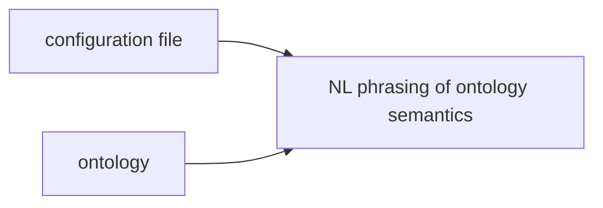

# OWL_DSL
A Python Library for creating and managing Domain Specific Languages (DSL) for OWL ontologies using Controlled Natural Languages 
(CNLs) [1], and naturally rendered definitions of its terms for use with Natural Language (NL) Processing tools such
as Large Language Models (LLMs), for example.  It primarily works with OWL ontologies in the [OWL 2 EL profile](https://www.w3.org/TR/owl2-profiles/#Feature_Overview).
but supports many aspects of other profiles as well.

## Table of Contents
- [Introduction](#introduction)
- [Install](#installation)
- [Options](#options)
- [CNL configuration](#cnl-configuration)
- [Loading Ontology](#loading-ontology)
- [Rendering Classes](#rendering-classes)
- [Listing Properties](#listing-properties)
- [Curate OWL DSLs](#curate-owl-dsls)
- [Reasoning](#reasoning)

## Introduction 
The OWL_DSL library was initially a script used to generate [cogbuji/MrGrammaticalOntology_anatomist (Grammatical Ontology Anatomist dataset)](https://huggingface.co/datasets/cogbuji/MrGrammaticalOntology_anatomist),
extracted from the Web Ontology Language (OWL) representation of the Foundational Model of Anatomy [2] using Owlready2 to 
facilitate the extraction and serialization of the logical axioms in the FMA into a CNL.

It uses Owlready2 as an Object Relational Mapper (ORM) between the OWL axioms and their corresponding Description Logics
constructs, extending them with syntax serialization using the CNL defined for the ontology.

As a result of the many [issues](https://github.com/cmungall/fma-fixes/issues/1) with the OWL representation of the FMA
for any contemporary work, the script was rewritten for [Uberon](https://obophenotype.github.io/uberon/),
a multi-species anatomy ontology, which had been useful for my prior bioinformatic research [3] involving the use of 
anatomical knowledge representation for studying organogenesis.

It is meant to be used with any OWL ontology that followed some basic naming conventions, annotations, and a CNL 
configuration file that specifies phrase templates for rendering classes, properties, and role restrictions in the 
ontology in NL:

- **rdfs:label** annotation properties are used to label the classes and properties
- a definition annotation is provided for human-readable definitions of classes and properties (such as the `definition` annotation property from the Information Artifact Ontology (IAO) (`http://purl.obolibrary.org/obo/IAO_0000115`))

These can be extended to allow for more expressive annotations about the object and data properties in the ontology.



## Installation

### Installation from PyPI

```bash
$ pip install owl_dsl
```

### Installation from Github

Below is an example of installing the library from the Github repository (after cloning it locally), using uv to 
[install it to a separate virtual environment](https://docs.astral.sh/uv/pip/environments/):

```bash
$ git clone https://github.com/chimezie/OWL_DSL.git owl_dsl
$ uv venv
$ source .venv/bin/activate
(scratch) $ uv pip install owl_dsl
```

If you wish, you can use the [nlp] optional dependency when installing the library to have spacy added as a dependency
(for use in handling word types/senses) and installed automatically:

```bash
(scratch) $ uv pip install owl_dsl[nlp]
```

## Options

There are two command-line tools for OWL ontologies:
- owl_dsl.review: a tool for rendering a class, searching for classes/properties, and loading an ontology,  
- owl_dsl.reason: a tool for reasoning over an ontology and explaining the entailment of its axioms  

The full command-line options for `owl_dsl.review` are:

```bash
$ owl_dsl.review --help
Usage: owl_dsl.review [OPTIONS] [OWL_URL_OR_PATH]

Options:
  -a, --action [render_class|find_properties|load_owl|destroy_sqlite|find_classes]
                                  Action to perform  [required]
  --by-id                         Find ontology class by ID (otherwise by
                                  rdfs:label)
  --class-reference TEXT          The ID (or label) of the Uberon class
  --class-search TEXT             The string to use for searching for a class
                                  to use
  --regex-search / --no-regex-search
  --verbose / --no-verbose
  --exact-class-labels / --no-exact-class-labels
                                  Render OWL class labels as is (don't convert
                                  to lower case by default)
  --configuration-file TEXT       Path to configuration YAML file for NL
                                  rendering of ontology terms  [required]
  --sqlite-file TEXT              Location of SQLite file used for persistence
                                  [required]
  --prefix TEXT                   Filter properties by URI prefix (only for
                                  'find_properties' action)
  --prop-reference-label TEXT     Filter properties by rdfs:label using REGEX
                                  (only for 'find_properties' action)
  --show-property-definition-usage
                                  Show class definition examples for listed
                                  properties (only for 'find_properties'
                                  action)
  --limit INTEGER                 Limit number of results (only for
                                  'find_properties' action with --show-
                                  property-definition-usage)
  --ontology-uri TEXT             The URI of the ontology  [required]
  --ontology-namespace-baseuri TEXT
                                  The base URI of the ontology namespace
                                  [required]
  --help                          Show this message and exit.
```

Most importantly, the `--ontology-uri` option specifies the URI/IRI of the world/ontology into which the
ontology is loaded.  This corresponds to the URI used to 
[retrieve an ontology from the owlready2 World](https://owlready2.readthedocs.io/en/v0.50/world.html#using-several-isolated-worlds).

The `--ontology-namespace-baseuri` specifies the base URI of the ontology 
namespace and can be used to look up entities by their [local names](https://www.w3.org/TR/owl-syntax/#IRIs). 
Also, OWL_DSL uses Owlready2's SQLite-based persistence to store (and query) the ontology.  The location of the SQLite
file is specified by the `--sqlite-file` option.

## CNL configuration

In order to facilitate the NL rendering of OWL classes, you need to provide a configuration file that specifies the 
textual templates for rendering classes and properties in a specified ontology. 

OWL_DSL includes a config in the `ontology_configurations` directory named OBO.CNL.yaml with such templates for ontologies
in the [Open Biological and Biomedical Ontology Foundry](https://obofoundry.org/) as an example.

They are expected to define the following directives (some of which are optional):

### tooling.expert_definition_properties

If you include this directive (regarding the [IAO ontology](https://obofoundry.org/ontology/iao.html)'s definition property, for example):
```yaml
tooling:
  expert_definition_properties: ['http://purl.obolibrary.org/obo/IAO_0000115', #Information Artifact Ontology (IAO) define
                                  # A phrase describing how a term should be used and/or a citation to a work which uses
                                  # it. May also include other kinds of examples that facilitate immediate understanding,
                                  # such as widely know prototypes or instances of a class, or cases where a relation is
                                  # said to hold.
                                  ]
```

then any value of the `definition` (`IAO_0000115`) property asserted on a class or property, will be used to render the 
definition of classes and properties in the ontology.

### standard_role_restriction_is_phrasing

This directive is expected to point to a list of URIs, which are considered to be properties (or 'roles') whose CNL 
templates can be determined via (where `prop_label` is the _*rdfs:label*_ of the property):

> is [prop_label] {}

This template may not make (grammatic) sense for all properties, so the `role_restriction_phrasing` directive can be used 
to specify a custom definition prompt.

### role_restriction_phrasing

To render a fully custom definition prompt (and singular/plural rendering of a role restriction), you
can use this directive in this way:

```yaml
role_restriction_phrasing:
  # existence starts during or after
  # x existence starts during or after y if and only if the time point at which x starts is after or equivalent to the
  # time point at which y starts. Formally: x existence starts during or after y iff α (x) >= α (y).
  'http://purl.obolibrary.org/obo/RO_0002496':
    - 'began during or after {}'
    - 'began during or after {}'
    - 'What does {} begin during or after?'
```

It expects 3 items under the URI of the property as top item.  The first two are the singular/plural rendering of the role restrictions
The final is the definition prompt.  The definition prompt is the phrase used as input/instruction that is paired with 
the rendering of the role restriction.  This allows a collection of these pairs to be used to construct an OWL-based
dataset.

### reflexive_role

This directive allows you to specify how to render a role restriction involving a reflexive property.  For example:

```yaml
reflexive_roles:
  - 'http://purl.obolibrary.org/obo/RO_0002481':
    - 'that interacts with itself via kinase activity'
```

## Loading Ontology
An ontology (Oberon in this case) can be initially loaded this way:

```bash
$ owl_dsl.review --ontology-uri "http://purl.obolibrary.org/obo/uberon/uberon-base.owl#" \
                 --configuration-file ontology_configurations/OBO.CNL.yaml \
                 --sqlite-file /tmp/uberon.sqlite3 \
                 --ontology-namespace-baseuri=http://purl.obolibrary.org/obo/ \
                 -a load_owl /path/to/uberon-base.owl
```

## Rendering Classes
Once the ontology is loaded, classes can be rendered using the `render_class` action, which is the default action and used
if none is specified via the `-a/--action` option.For example, the logical definition of the `vestibular aqueduct` Uberon class can be 
rendered via reference to either its label or its ontology local identifier (`UBERON_0002279`):

```bash
$ owl_dsl.review --ontology-uri "http://purl.obolibrary.org/obo/uberon/uberon-base.owl#" \
                 --configuration-file ontology_configurations/OBO.CNL.yaml \
                 --sqlite-file /tmp/ontology.sqlite3 \
                 --ontology-namespace-baseuri=http://purl.obolibrary.org/obo/ \
                 --class-reference "vestibular aqueduct" 
Loaded ontology
[..snip..]
# http://purl.obolibrary.org/obo/UBERON_0002279 (vestibular aqueduct) # 
## Textual definition ##
At the hinder part of the medial wall of the vestibule is the orifice of the vestibular aqueduct, which extends to the posterior surface of the petrous portion of the temporal bone. It transmits a small vein, and contains a tubular prolongation of the membranous labyrinth, the ductus endolymphaticus, which ends in a cul-de-sac between the layers of the dura mater within the cranial cavity. [WP,unvetted]. 

## Logical definition ##
The vestibular aqueduct is defined in Uber-anatomy ontology as a foramen of skull that is a conduit for a vein of vestibular aqueduct. It is a foramen of skull. It is part of an osseus labyrinth vestibule. It is a conduit for a vein of vestibular aqueduct
```

This shows the URI, label, any textual definition provided by the annotation property defined in the configuration, 
and a human-readable definition of the logical definition of the corresponding OWL class in NL. Below is an example of
how the same class can be rendered using the ontology local identifier:

```bash
$ owl_dsl.review --ontology-uri "http://purl.obolibrary.org/obo/uberon/uberon-base.owl#" \
                 --configuration-file ontology_configurations/OBO.CNL.yaml \
                 --sqlite-file /tmp/ontology.sqlite3 \
                 --ontology-namespace-baseuri=http://purl.obolibrary.org/obo/ \
                 --by-id --class-reference UBERON_0002279
[..snip..]
```

Note, the tool will complain about nlp not being initialized, which it can use to help with part of speech tagging
for the NL rendering.  This can be addressed by installing spacy and running:

```bash
$ uv run spacy download en_core_web_sm
```

If using uv or just (if not)

```bash
spacy download en_core_web_sm
```

The `--exact-class-labels` option, if specified, will cause the class label to be rendered as is, without converting
them to lower case, which is the default behavior.  This is useful when later referring to those classes via `--class-reference`,
which matches them by their exact label.

## Finding Properties

The `find_properties` action can be used to list all properties in the ontology, matched by a specified URI  
prefix or a REGEX pattern to apply to their **rdfs:label** values.  The `--show-property-definition-usage`, if specified, will
cause an example class, whose definition directly refers to the property, or more (via the ``--limit``` toption).

For example, we can find all the BFO properties 
defined in the ontology:

```bash
$ owl_dsl.review --ontology-uri "http://purl.obolibrary.org/obo/uberon/uberon-base.owl#" \
                 --configuration-file ontology_configurations/OBO.CNL.yaml \
                 --sqlite-file /tmp/ontology.sqlite3 \
                 --ontology-namespace-baseuri=http://purl.obolibrary.org/obo/ \ 
                 -a find_properties \
                 --prefix http://purl.obolibrary.org/obo/BFO_ \
                 --show-property-definition-usage --limit 1
-  http://purl.obolibrary.org/obo/BFO_0000050 'part of' "a core relation that holds between a part and its whole"
	- http://purl.obolibrary.org/obo/GO_0061224 'mesonephric glomerulus development'
	- The mesonephric glomerulus development is defined in Uber-anatomy ontology as an anatomical structure development that results in the development of a mesonephric glomerulus. It is a glomerulus development. It is part of a mesonephric nephron development. It results in the development of a mesonephric glomerulus
[..snip..]
-  http://purl.obolibrary.org/obo/BFO_0000063 'precedes' "x precedes y if and only if the time point at which x ends is before or equivalent to the time point at which y starts. Formally: x precedes y iff ω(x) <= α(y), where α is a function that maps a process to a start point, and ω is a function that maps a process to an end point."
	- http://purl.obolibrary.org/obo/CL_0009086 'endothelial cell of respiratory system lymphatic vessel'
	- The endothelial cell of respiratory system lymphatic vessel is defined in Uber-anatomy ontology as an endothelial cell that is part of a respiratory system lymphatic vessel. It is an endothelial cell of lymphatic vessel. It is part of a respiratory system lymphatic vessel endothelium
[..snip..]                 
```

## Curate OWL DSLs
You can use a combination of the `find_properties` and `render_class` actions to browse the vocabulary of the ontology.
and find _"verbalizations"_ of the ontology terms that are awkward, identify the roles involved in the restriction 
expression used to render those awkward phrases, and update the CNL configuration with corresponding entries.  Without
such a configuration, the fallback approach to rendering an existential role restriction is to use this pattern:

```
is {prop_label} {value_name}"
```
Where `prop_label` is the label of the property being restricted and `value_name` is the name of the value in the restriction.

The most basic configuration is to add the property URI to the `standard_role_restriction_is_phrasing` directive.

## Reasoning ##

The `owl_dsl.reason` command-line tool can be used to for various reasoning tasks over an ontology that leverage
the NL rendering capabilities of OWL DSL to render axioms and their justifications in a human-readable format.

The full command-line options for `owl_dsl.reason` are:

```bash
$ owl_dsl.reason --help
Usage: owl_dsl.reason [OPTIONS] [OWL_URL_OR_PATH]

Options:
  -a, --action [explain_logical_inferences|justify_gci]
                                  Action to perform  [required]
  --ontology-uri TEXT             The URI of the ontology  [required]
  --ontology-namespace-baseuri TEXT
                                  The base URI of the ontology namespace
                                  [required]
  --sqlite-file TEXT              Location of SQLite file used for persistence
                                  [required]
  --configuration-file TEXT       Path to configuration YAML file for NL
                                  rendering of ontology terms  [required]
  --class-reference TEXT          The IRI (or label) of the Uberon class
  --manchester-owl-expression TEXT
                                  Manchester OWL expression for GCI (used with
                                  justify_gci
  --by-id                         Find ontology class by ID (otherwise by
                                  rdfs:label)
  --verbose / --no-verbose
  --exact-class-labels / --no-exact-class-labels
                                  Render OWL class labels as is (don't convert
                                  to lower case by default)
  --help                          Show this message and exit.
```

### Displaying the entailment of an ontology ###

The 'explain_logical_inferences' action of the `owl_dsl.reason` command-line tool can be used to provide a NL rendering
of a proof for logically entailed General Concept Inclusion (GCI) axioms of an ontology, i.e., 
[rdfs:subClassOf](https://www.w3.org/TR/rdf11-schema/#ch_subclassof) or subsumption axioms. In particular, it will do 
so for GCI axioms entailed by the ontology, ignoring those that are directly asserted in the ontology.

The starting point for this is an OWL class, specified by its local name or label as before using the `--class-reference` 
and --by-id options.  Below is an example of how we can do this for the 'vestibular aqueduct' class from earlier:

```bash
$ owl_dsl.reason --ontology-uri "http://purl.obolibrary.org/obo/uberon/uberon-base.owl#" \
                 --configuration-file ontology_configurations/OBO.CNL.yaml \
                 --sqlite-file /tmp/ontology.sqlite3  \
                 --ontology-namespace-baseuri=http://purl.obolibrary.org/obo/ \
                 --class-reference "vestibular aqueduct" uberon-base-plus-ro.owl
# http://purl.obolibrary.org/obo/UBERON_0002279 (vestibular aqueduct) # 
## Textual definition ##
At the hinder part of the medial wall of the vestibule is the orifice of the vestibular aqueduct, which extends to the posterior surface of the petrous portion of the temporal bone. It transmits a small vein, and contains a tubular prolongation of the membranous labyrinth, the ductus endolymphaticus, which ends in a cul-de-sac between the layers of the dura mater within the cranial cavity. [WP,unvetted]. 

## Logical definition ##
The vestibular aqueduct is defined in Uber-anatomy ontology as a foramen of skull that is a conduit for a vein of vestibular aqueduct. It is a foramen of skull. It is part of an osseus labyrinth vestibule. It is a conduit for a vein of vestibular aqueduct
------------------------------------------------------------
How is every 'vestibular aqueduct' (UBERON_0002279) a 'bone foramen'?

  Every vestibular aqueduct is a foramen of skull that is a conduit for a vein of vestibular aqueduct and vice versa.
    Every foramen of skull is a bone foramen
------------------------------------------------------------
How is every 'vestibular aqueduct' (UBERON_0002279) a 'anatomical conduit'?

  Every vestibular aqueduct is a foramen of skull that is a conduit for a vein of vestibular aqueduct and vice versa.
    Every foramen of skull is a bone foramen
      Every bone foramen is an anatomical conduit that is part of a bone element and vice versa.
------------------------------------------------------------
```

It uses robot's [reason](https://robot.obolibrary.org/explain) command to generation the entailment proof/explanation
and the mechanisms of this library to render them in human-readable form.

### Skipping GCI axioms ###

Some logically entailed GCI axioms are not semantically useful, usually because they involve subsumption with classes
that often reside too high in an upper ontology such as [Basic Foundational Ontology BFO](https://basic-formal-ontology.org/) 
to be of practical use.  A list of the labels of OWL classes can be specified in the configuration file to address
this.  Below is an excerpt from the configuration file for the OBO Foundry demonstrating this:

```yaml
#Classes too general to render while navigating entailed axioms
class_inference_to_ignore: ['material anatomical entity',
                            'anatomical entity',
                            'anatomical structure',
                            'multicellular anatomical structure',
                            'molecular_function',
                            'occurrent',
                            'process',
                            'independent continuant',
                            'continuant',
                            'material entity',
                            'molecular entity']
```

This can be extended to include any class that is not semantically useful for the purpose of rendering.  Any GCI axioms
involving these classes will be ignored by the `owl_dsl.reason` command.

### Explaining adhoc GCI Axioms ###
Finally, the 'justify_gci' action of the `owl_dsl.reason` command-line tool can be used to provide a NL rendering
of a proof or explanation of a GCI axiom involving a class identified by its IRI or label and an arbitrary OWL expression
specified as valid Manchester OWL 2 syntax, a ["a user-friendly compact syntax for OWL 2 ontologies"](https://www.w3.org/TR/owl2-manchester-syntax/).  This is give with the `--manchester-owl-expression` option and this relies on 
[owlapy's ability to parse Manchester expressions](https://dice-group.github.io/owlapy/usage/usage_examples.html#convert-to-sparql-dl-or-manchester-syntax).

Below is an example of how we can do this for a _'histamine secretion mediated by IgE immunoglobulin'_ example, involving explanations of more expressive OWL 2 features 
of the OWL 2 EL profile, terms, labels, and definitions from the GO, Uberon, and RO ontologies (merged together
using robot, and loaded using the `load_owl` action), and NL templates that elaborate on the semantics of some of the
process/input roles to more naturally express the GCI axioms in a human-readable form:

```bash
$ owl_dsl.reason --ontology-uri "http://purl.obolibrary.org/obo/go/extensions/go-plus.ofn#" \
                 --configuration-file ontology_configurations/OBO.CNL.yaml \
                 --sqlite-file /path/to/go.sqlite3  \
                 --ontology-namespace-baseuri=http://purl.obolibrary.org/obo/ 
                 go-plus-uberon-and-ro.owl -a justify_gci 
                 --class-reference "histamine secretion mediated by IgE immunoglobulin" \
                 --manchester-owl-expression "'process' and 'part of' some 'inflammatory response'"
[..snip,,]
# http://purl.obolibrary.org/obo/GO_0097279 (histamine secretion mediated by IgE immunoglobulin) # 
## Textual definition ##
Histamine release triggered by the binding of an antigen to an IgE immunoglobulin bound to the cell surface. An example is mast cell histamine degranulation as a result of exposure of mast cell-bound IgE to alder tree pollen. 

## Logical definition ##
The histamine secretion mediated by IgE immunoglobulin is defined in Gene Ontology as a histamine secretion mediated by immunoglobulin. It is in a vertebrata <vertebrates> taxon
------------------------------------------------------------
How is every 'histamine secretion mediated by IgE immunoglobulin' (GO_0097279) a 'process' and 'part of' some 'inflammatory response'?

  Every histamine secretion mediated by IgE immunoglobulin is a histamine secretion mediated by immunoglobulin
    Every histamine secretion mediated by immunoglobulin is a histamine secretion involved in inflammatory response
      Every histamine secretion involved in inflammatory response is a histamine secretion that is part of an inflammatory response and vice versa.
        Every histamine secretion is a histamine transport
          Every histamine transport is a transport that has a histaminium as its primary input, to modify, consume, or transform and vice versa.
            If A has B as its primary input, to modify, consume, or transform, then A has B as its primary input, to modify, consume, or transform also ('has primary input' is a subproperty of 'has input')
              If A is related to B via 'has input' then A is a 'process'
```
Here, the `--manchester-owl-expression` option is used to specify the following Manchester OWL expression (using labels 
to refer to the OWL classes and properties):

```
'process' and 'part of' some 'inflammatory response'
```

This is the class of all processes that are part of an inflammatory response.  The request is to explain/justify
how "histamine secretion mediated by IgE immunoglobulin" is a subClassOf (or is subsumed by) this class.

Finally, below is an example showing the rendering of disjunctive OWL axioms (groups of OWL expressions grouped by 'or'):

```bash
$ owl_dsl.reason --ontology-uri "http://purl.obolibrary.org/obo/go/extensions/go-plus.ofn#" \
                 --configuration-file ontology_configurations/OBO.CNL.yaml \
                 --sqlite-file /tmp/go.sqlite3  \
                 --ontology-namespace-baseuri=http://purl.obolibrary.org/obo/ go-plus-uberon-and-ro.owl \
                 -a justify_gci --class-reference "exocytosis" \
                 --manchester-owl-expression "'biological_process' and 'process has causal agent' some 'cellular_component'"
[..snip..]
# http://purl.obolibrary.org/obo/GO_0006887 (exocytosis) # 
## Textual definition ##
A process of secretion by a cell that results in the release of intracellular molecules (e.g. hormones, matrix proteins) contained within a membrane-bounded vesicle. Exocytosis can occur either by full fusion, when the vesicle collapses into the plasma membrane, or by a kiss-and-run mechanism that involves the formation of a transient contact, a pore, between a granule (for example of chromaffin cells) and the plasma membrane. The latter process most of the time leads to only partial secretion of the granule content. Exocytosis begins with steps that prepare vesicles for fusion with the membrane (tethering and docking) and ends when molecules are secreted from the cell. 

## Logical definition ##
[..snip..]
The exocytosis is defined in Gene Ontology as a vesicle-mediated transport that is caused by an exocytic vesicle. It is a vesicle-mediated transport. It is a secretion by cell. It has a vesicle fusion to plasma membrane as a part. It is caused by an exocytic vesicle
------------------------------------------------------------
How is every 'exocytosis' (GO_0006887) a 'biological_process' and 'process has causal agent' some 'cellular_component'?

[..snip..]
  Every exocytosis is a vesicle-mediated transport
    Every vesicle-mediated transport is a transport that is caused by a vesicle and vice versa.
      Every vesicle is a membrane-bounded organelle
        Every membrane-bounded organelle is an organelle
          Every organelle is a cellular anatomical structure
  Every exocytosis is a secretion by cell
    Every secretion by cell is an export from cell
      Every export from cell is a cellular process
        Every cellular process is a biological_process
  Every cellular_component is a protein-containing complex, a virion component, or a cellular anatomical structure and vice versa.
```

This examle shows the difference between the ontology's label for `"process has causal agent"` object property and the 
template used to render it:

```yaml
  'http://purl.obolibrary.org/obo/RO_0002608':
    - 'is caused by {}'
    - 'is caused by {}'
    - 'What is caused by {}?'
```

# Citations #
1. Fuchs, N. E., Kaljurand, K., & Kuhn, T. (2008). *Attempto controlled english for knowledge representation*. In Reasoning Web: 4th International Summer School 2008, Venice, Italy, September 7-11, 2008, Tutorial Lectures (pp. 104-124). Berlin, Heidelberg: Springer Berlin Heidelberg.
2. Rosse, Cornelius, and José LV Mejino Jr. *A reference ontology for biomedical informatics: the Foundational Model of Anatomy.* Journal of biomedical informatics 36.6 (2003): 478-500.
3. Ogbuji, Chimezie, and Rong Xu. *Lattices for representing and analyzing organogenesis.* Conference on Semantics in Healthcare and Life Sciences (CSHALS 2014), 2014. 

